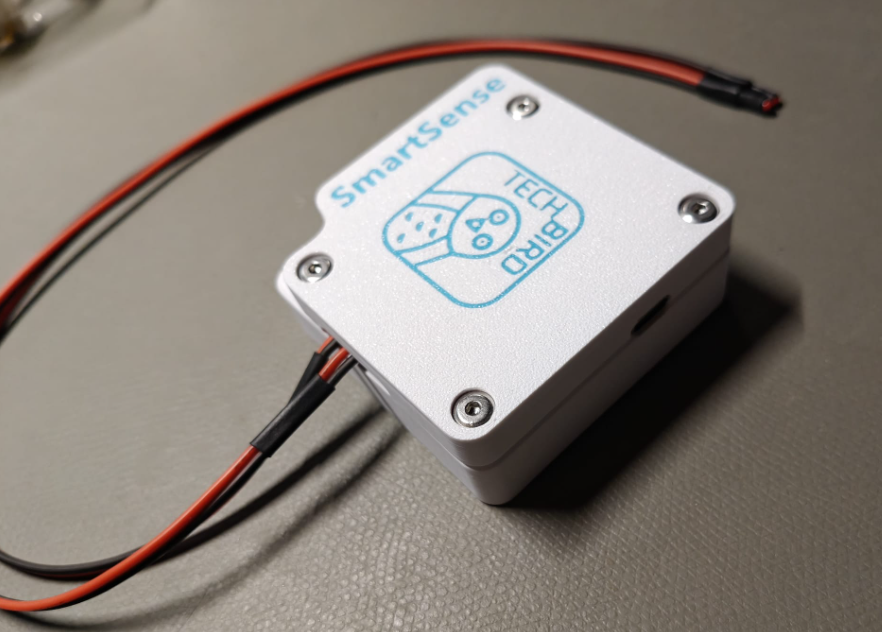
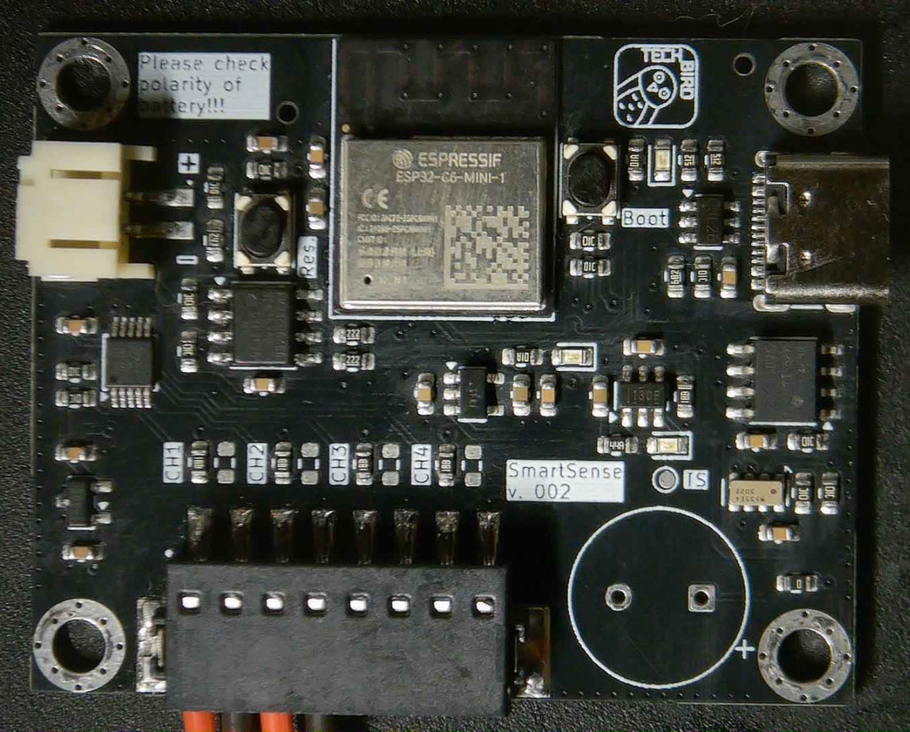
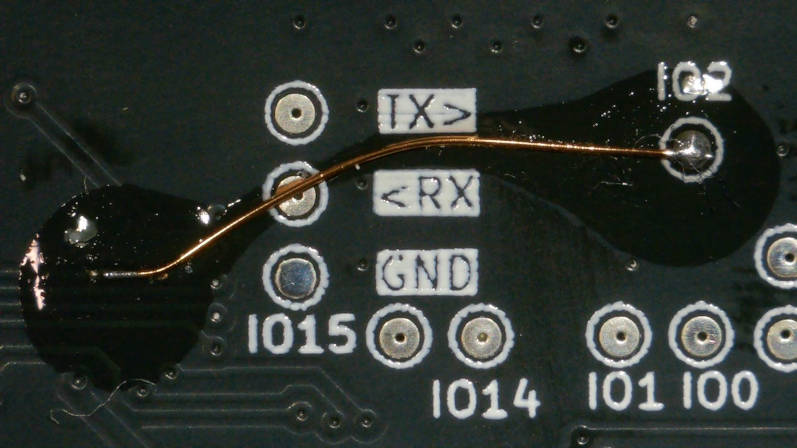
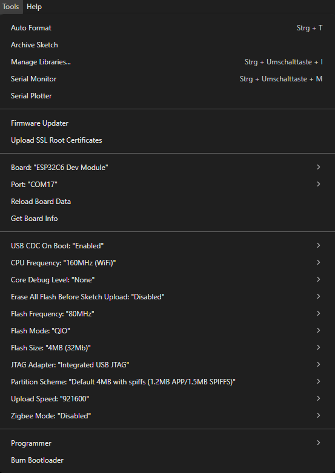

# Introduction
TechBird-SmartSense is an IoT device with a 4-channel 12-Bit ADC, to measure up to 4 temperatures. In addition it also provides an internal temperature sensore for ambiant temperatures.

# Features
- ESP32-C6-MINI-1-N4: As module
- EEMB LP103454: 2000 mAh Lipo Battery
  - 7 days of uptime with 10 seconds time gab, and ringbuffer size of 60
- ADS1015IDGSR: 2 Differntiall or 4 Channel 12-Bit ADC
- FM24CL64B-GTR: 64 kB FRAM
- RV-3028-C7: Internal RTC
- TMP1075D: Internal Temperature Sensor
- USB Type-C for communication and charging

# Software
- Use at your own risk!
- Basic UI via USB (115200, 8, n, 1)
- Sending Data via MQTT
- Again... use at your own risk!
- Bugs are free to find, and free to fix.

# Known Bugs
## Hardware
- For some reasons, unknown to men, the LiPo Battery is necessary, to provide enough energy for initial W-LAN connection. Or maybe use a beefier USB power supply
- WKUP need to be routed to IO2

## Software
- When ringbuffer loops, one set of wrong data will be send

# Known Nuisances
- When in deep sleep, attaching USB connection won't reset the device and the lid need to be removed in order to get to the bootmenu
- Main connector is not made to be removed frequently, which makes charging pretty annoying

# Arduino IDE Setup
- The settings should look something like this:
  

- The following libraries shoulld be installed:
  - https://github.com/arduino-libraries/Arduino_JSON
  - https://github.com/arduino-libraries/NTPClient
  - https://github.com/adafruit/Adafruit_ADS1X15
  - https://github.com/hideakitai/DebugLog
  - https://github.com/RobTillaart/FRAM_I2C
  - https://github.com/256dpi/arduino-mqtt
  - https://github.com/constiko/RV-3028_C7-Arduino_Library